# Progetto Laboratorio Amministrazione di Sistema

## Introduzione

Il progetto consiste nel simulare una rete Ethereum privata usando dei container Docker. Nello specifico i vari componenti simulati sono:

- Un bootnode,
- Un nodo RPC per gestire le comunicazioni con i client,
- Uno o più nodi miner per elaborare le transazioni,
- Un database Influx contenente le metriche dei vari nodi,
- Un block explorer per tenere sotto controllo la blockchain in tempo reale.

## Tecnologie usate

Per la corretta esecuzione del progetto viene usato Docker in modalità Swarm, questo per permettere l'uso dei Secrets e per facilitare la scalabilità delle operazioni. Questo permeterebbe deployare facilmente una mining farm per una rete privata mantenendo uno stretto controllo sui miner.

## Come far partire tutto

1. Eseguire il comando: `git clone https://github.com/nardin-manuel/LAS.git`

2. Installare l'estensione del browser Metamask e creare un nuovo portafoglio seguendo le istruzioni.

3. Copiare l'indirizzo del nuovo portafoglio creato e incollarlo nel campo "Miner Address" del file config.json. Questo sarà il portafoglio nel quale saranno depositate le ricompense di mining.

4. Creare un secondo portafoglio che verrà usato per una transazione di prova:
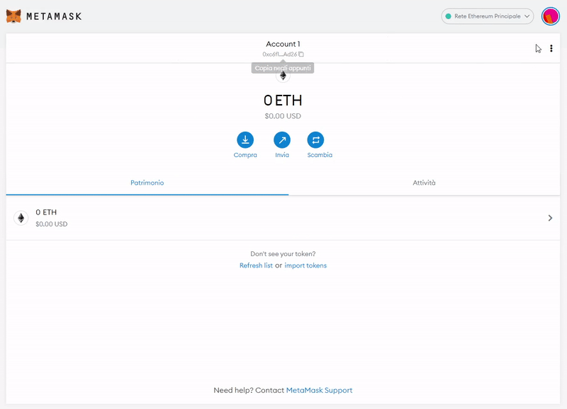

5. Eseguire il comando `docker stack deploy --compose-file docker-compose.influx.yml ethStack` per avviare uno swarm con il database.

6. Visitare [questo link](http://localhost:18086/) e procedere con la configurazione iniziale del database.

7. Compilare i campi `INFLUXDB_ORG` e `INFLUXDB_BUCKET` del file config.json in base a come è stato configurato il database al punto 4.

8. Creare un nuovo token come mostrato nelle immagini
    - Andare in Data(1), Tokens(2) e cliccare su "Generate Token(3)":
     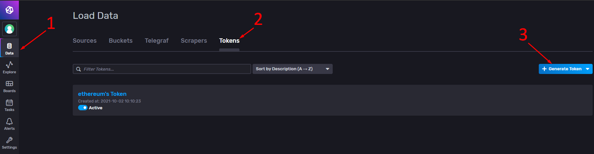
    - Scegliere "Read/Write Token":
     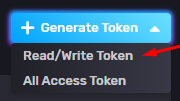
    - Dare una descrizione al token, e scegliere i permessi. Cliccare poi su "Save":
    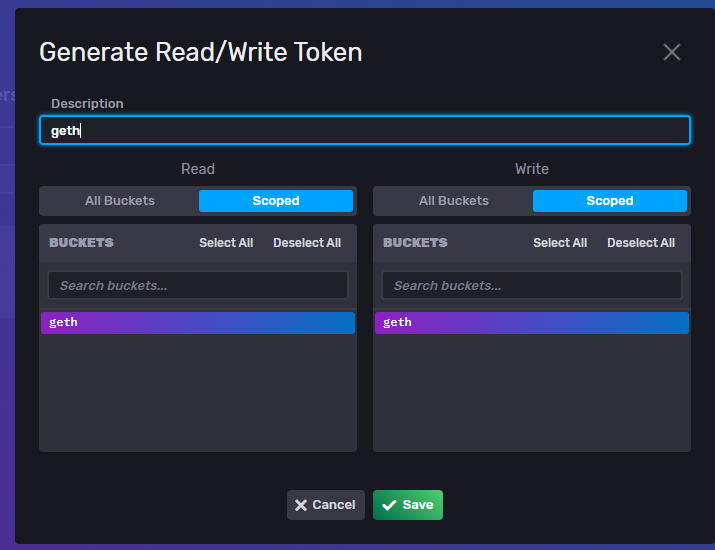

9. Cliccare sul token appena creato e copiarlo sulla clipboard:
    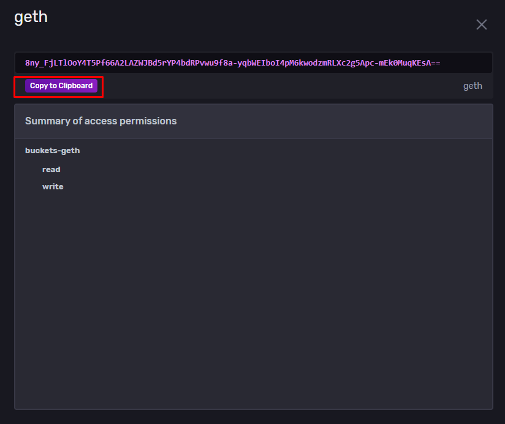

10. Eseguire il comando `echo "token" | docker secret create influx_token -` sostitudendo il token copiato al posto di `"token"`.

11. Eseguire il comando `docker compose build && docker stack deploy --compose-file docker-compose.yml ethStack` per aggiungere un bootnode, un fullnode e un minernode allo swarm precedentemente avviato.

12. Eseguire il comando `docker run --name blockExplorer -p 8080:80 -e APP_NODE_URL="http://localhost:8545" alethio/ethereum-lite-explorer` per avviare il block explorer.

13. Configurare la rete privata inserendo i seguenti parametri:
    - Nome rete: a scelta;
    - URL RPC: http://127.0.0.1:8545
    - Chain Id: 69
    - Url del block explorer: http://localhost:8080
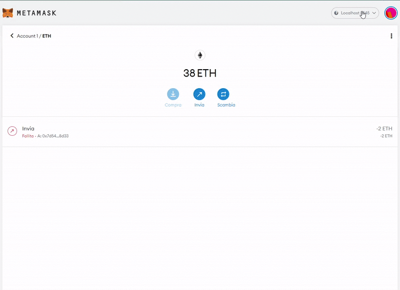

14. Verificare che il miner sia operativo e non stia ancora creando il DAG(Directed Acyclic Graph)
    - Apriamo i log del miner:

    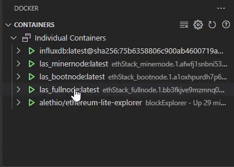

    - Verifichiamo a che punto siamo con la creazione del DAG:

    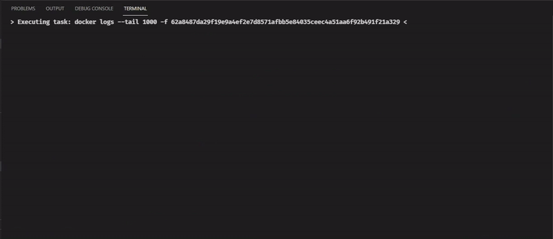

15. Se il DAG è stato creato possiamo procedere con una transazione di prova da un portafoglio all'altro:
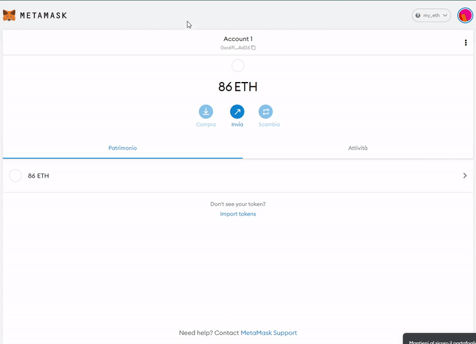

16. Verifichiamo l'esito della transazione:
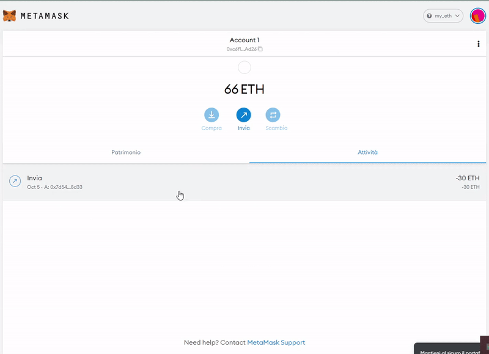

17. Possiamo inoltre vedere la transazione appena effettuata nel block explorer, dove troveremo informazioni quali il blocco che ha incluso la transazione e l'ammontare delle gas fee:
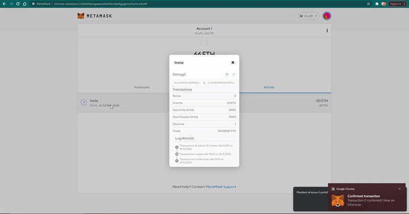